# Intel Image Classification

This project is part of a computer vision project where we classify landscape images.

## 📁 Dataset

We use the Intel Image Classification Dataset which includes images in the following categories:

- Buildings
- Forest
- Glacier
- Mountain
- Sea
- Street

The dataset is structured into:

```
dataset/
├── seg_train/
│   └── [class folders]
├── seg_test/
│   └── [class folders]
└── seg_pred/
    └── [unlabeled images]
```

## ⚙️ Environment Setup

```bash
pip install torch torchvision matplotlib seaborn
```

Or use the pre-installed environment in [Google Colab](https://colab.research.google.com/).

## Підготовка до виконання проекту

First of all looked at the all classes and number of images in each training class


Than, as you can see in diagram the number of images in all classes quite simillar so we do not need to trim anything 
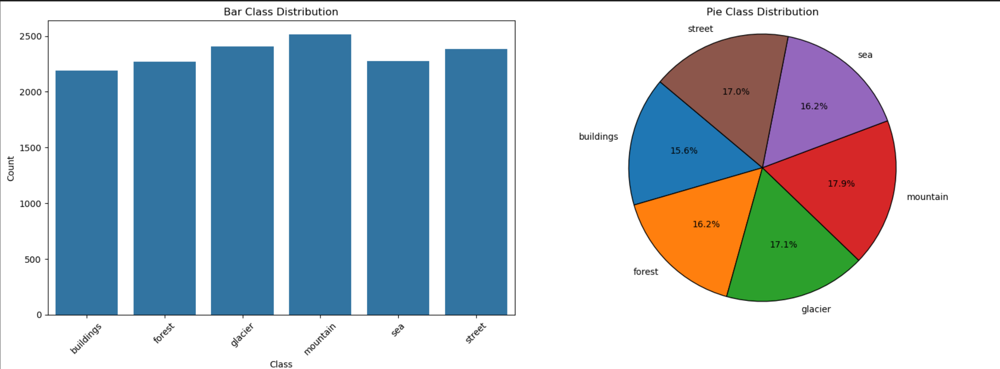

Also, let's look at the images form each class
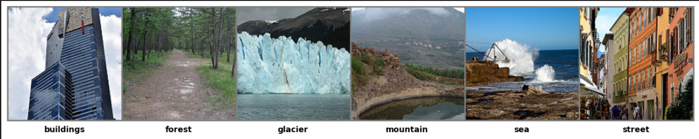

## Побудова базової моделі нейронної мережі

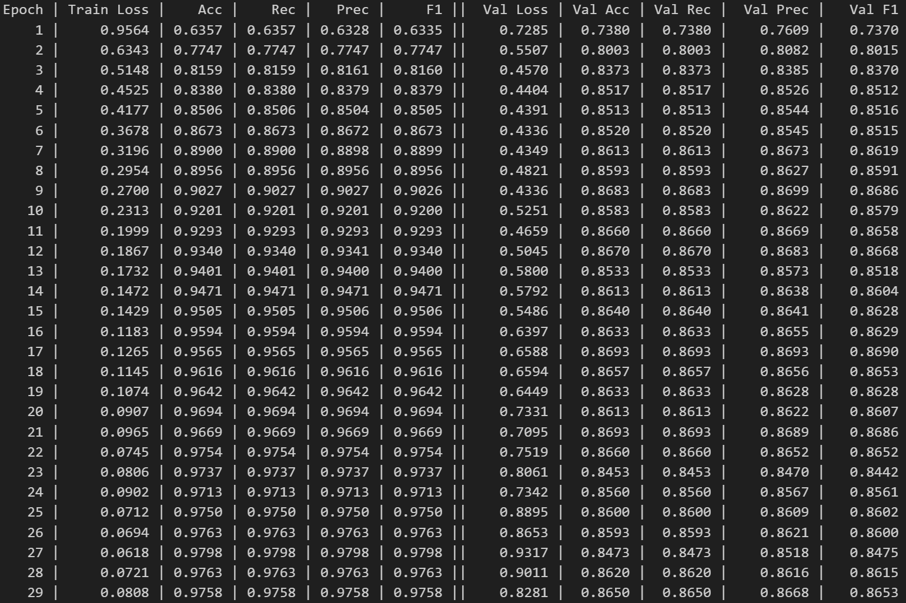
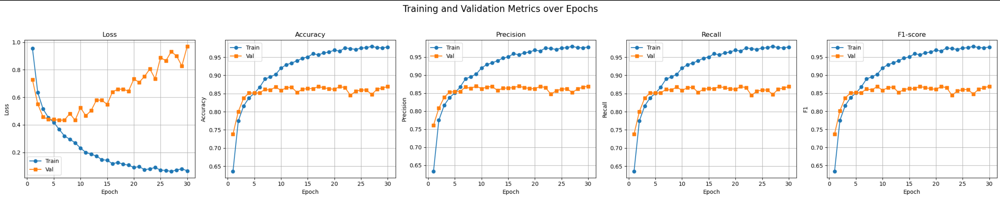
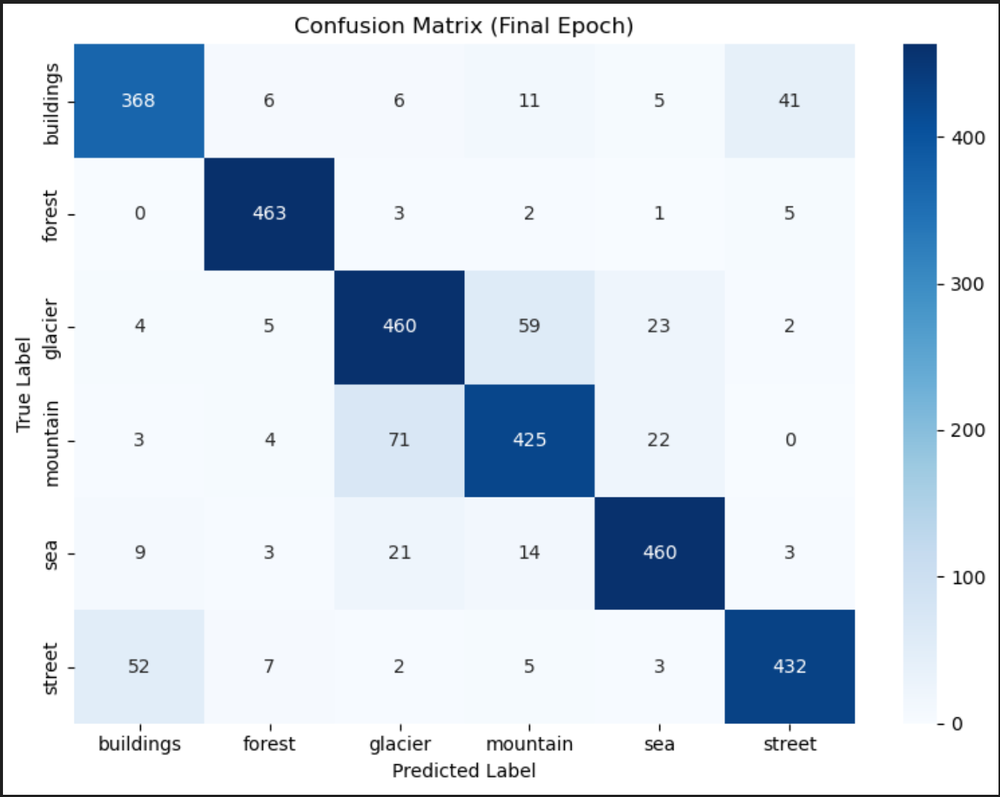
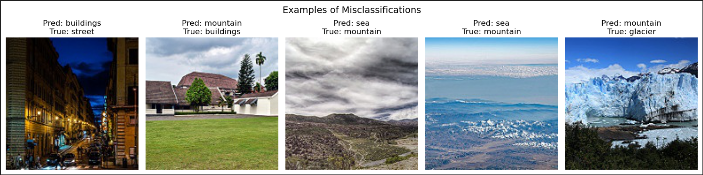

## Оптимізація гіперпараметрів моделі нейронної мережі

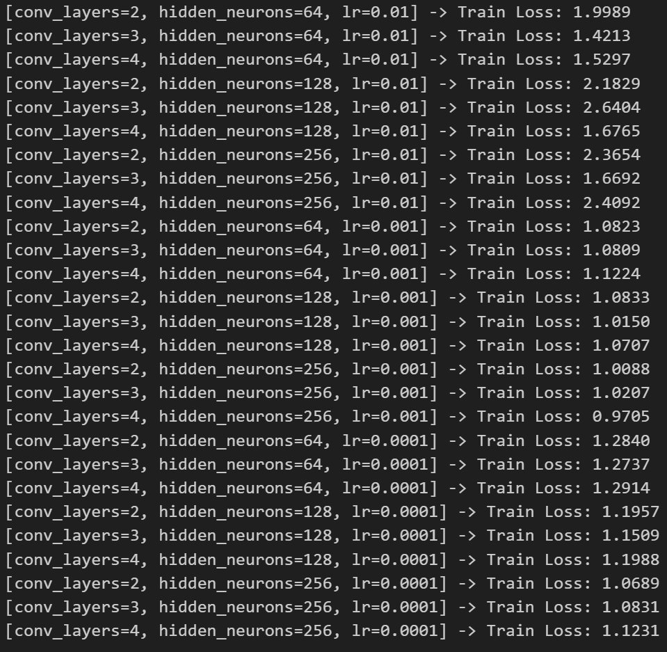
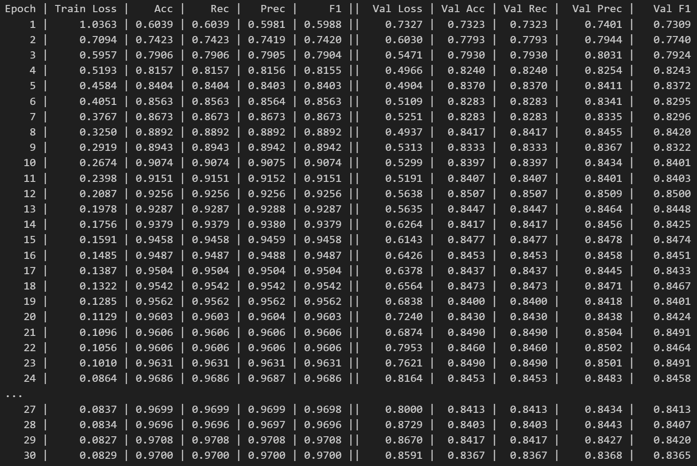
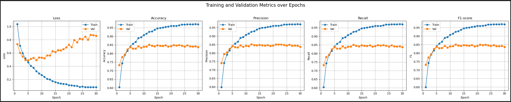
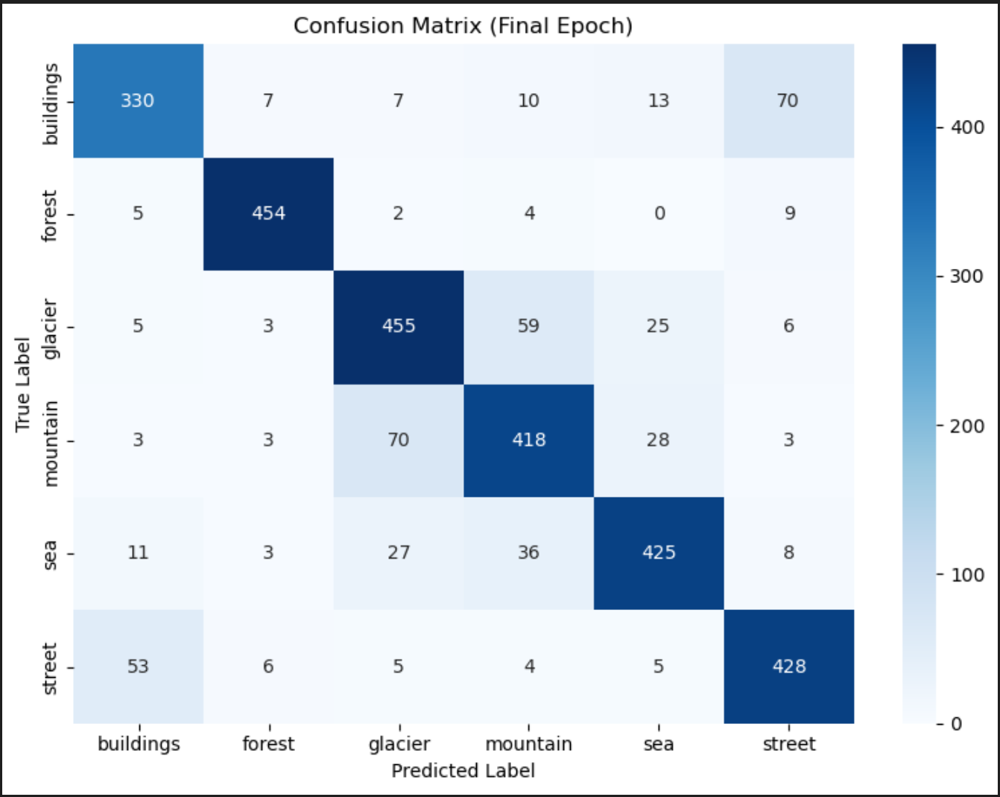
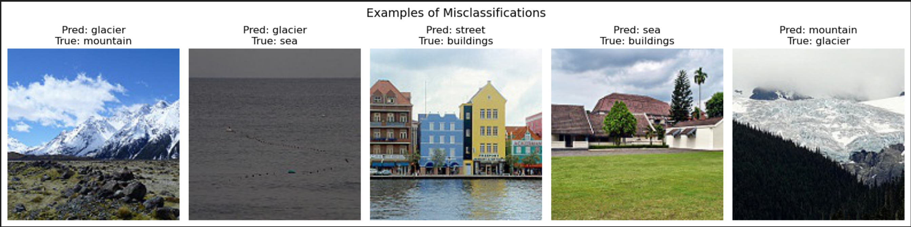

## Transfer learning

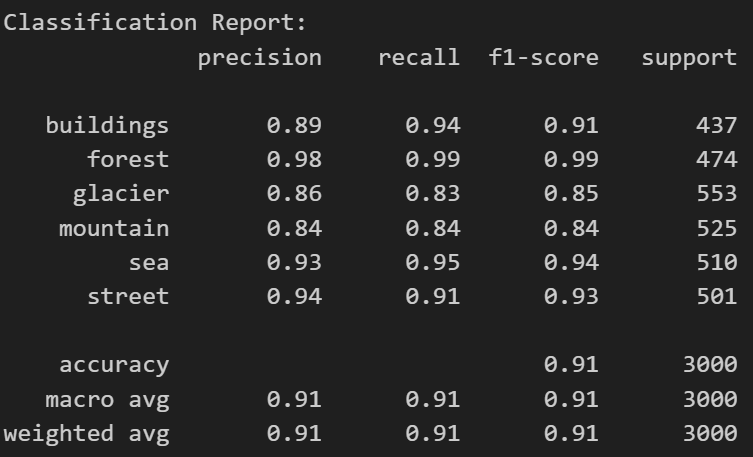
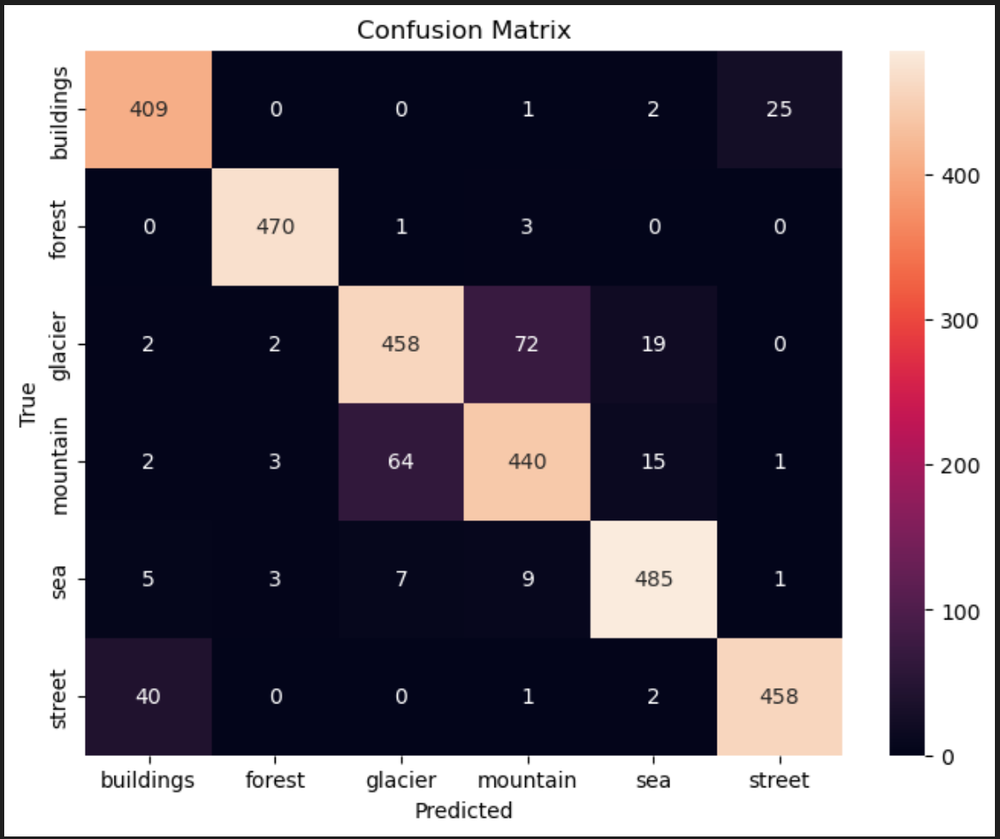

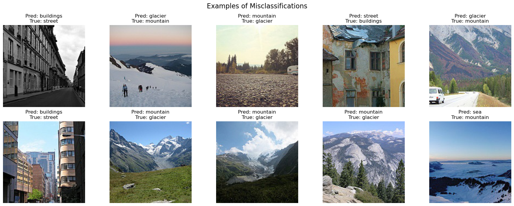


## ✅ To Run

Upload the dataset to Google Colab or extract locally, then run each notebook cell in order.

